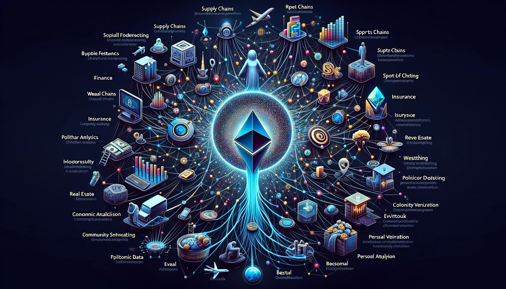

# What are the applications of Oracles?

Oracles serve as a bridge connecting the real world off-chain with DeFi projects, supply chain management, gaming, insurance, and more on the market. Here are some examples of data instances where oracles might interact with DApps:

- Data from capital markets, such as tokenized assets or stock prices.

- Geographical data for tracking progress in supply chains.

- Verification needed for insurance contracts.

- Sports outcomes for betting markets.

Additionally, oracles can be used in various other scenarios:

- Weather data for agricultural contracts or derivatives.

- Real estate prices for property-related financial instruments.

- Flight or shipping delays information for travel and logistics insurance.

- Political events or election results for prediction markets.

- Consumer price indices for adjusting the value of stablecoins or other financial instruments.

- Crowdsourced information for decentralized decision-making or governance systems.

- Personal identity verification for accessing restricted services or areas.

