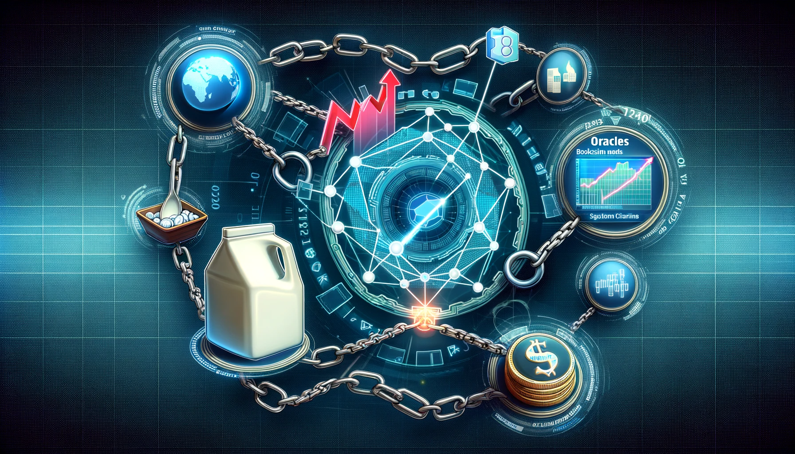

# What is Oracle ?
We recognize that the blockchain realm operates as a self-contained native network. However, if we aim to make it functional in everyday scenarios and need to import external data onto the blockchain, such as the current stock market trends, the price of a gallon of milk, or the latest sports scores, what approach should we take?

At this juncture, the blockchain domain requires a trustworthy information conduit, which is where oracles come into play. Through these oracles, a variety of DApps and smart contracts can access data outside the blockchain network, acting as a conduit between the on-chain universe and real-world dynamics.

