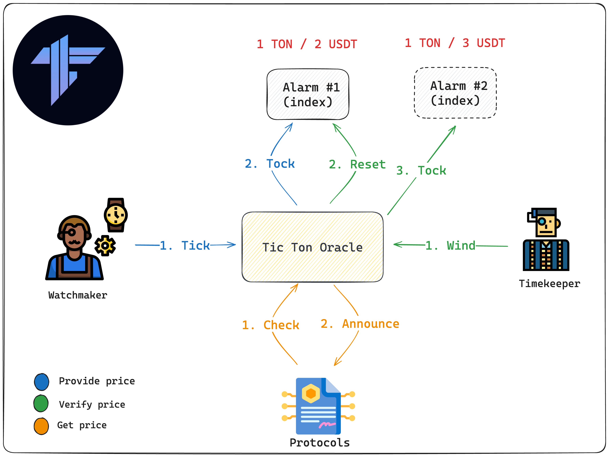
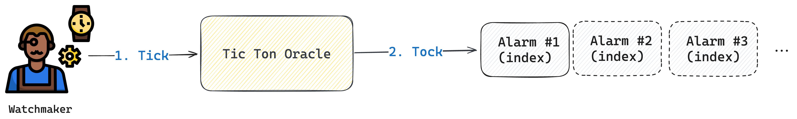
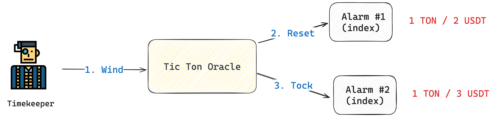
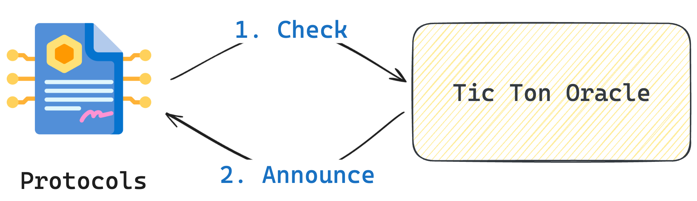
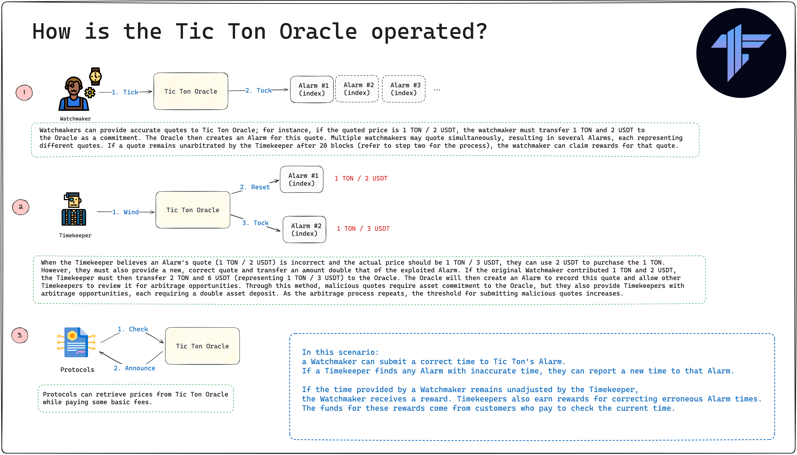

# How is the Tic Ton Oracle operated?
Welcome to the insightful exploration of the Tic Ton Oracle's operation. This section provides a comprehensive understanding of its innovative decentralized mechanism. We delve into the architecture and the step-by-step process that underlines the Oracle's functionality, offering a detailed view of its unique approach to maintaining accuracy and integrity in decentralized data verification. Let's embark on this journey to understand how the Tic Ton Oracle revolutionizes data validation and security.

## Architecture

## In-Depth Architecture Breakdown
**You can envision the Tic Ton Oracle  as the story below:**

A Watchmaker can submit a correct time to Tic Ton's Alarm.
If a Timekeeper finds any Alarm with inaccurate time, they can report a new time to that Alarm.

If the time provided by a Watchmaker remains unadjusted by the Timekeeper,
the Watchmaker receives a reward. Timekeepers also earn rewards for correcting erroneous Alarm times.
The funds for these rewards come from customers who pay to check the current time.

## Step1: Provide price by Watchmaker

## Step2: Verify price by Timekeeper

When the Timekeeper believes an Alarm's quote (1 TON / 2 USDT) is incorrect and the actual price should be 1 TON / 3 USDT, they can use 2 USDT to purchase the 1 TON.However, they must also provide a new, correct quote and transfer an amount double that of the exploited Alarm. If the original Watchmaker contributed 1 TON and 2 USDT, the Timekeeper must then transfer 2 TON and 6 USDT (representing 1 TON / 3 USDT) to the Oracle. The Oracle will then create an Alarm to record this quote and allow other Timekeepers to review it for arbitrage opportunities. Through this method, malicious quotes require asset commitment to the Oracle, but they also provide Timekeepers with arbitrage opportunities, each requiring a double asset deposit. As the arbitrage process repeats, the threshold for submitting malicious quotes increases.

## Step3: Protocols get price 

Protocols can retrieve prices from Tic Ton Oracle while paying some basic fees.

## Summary

